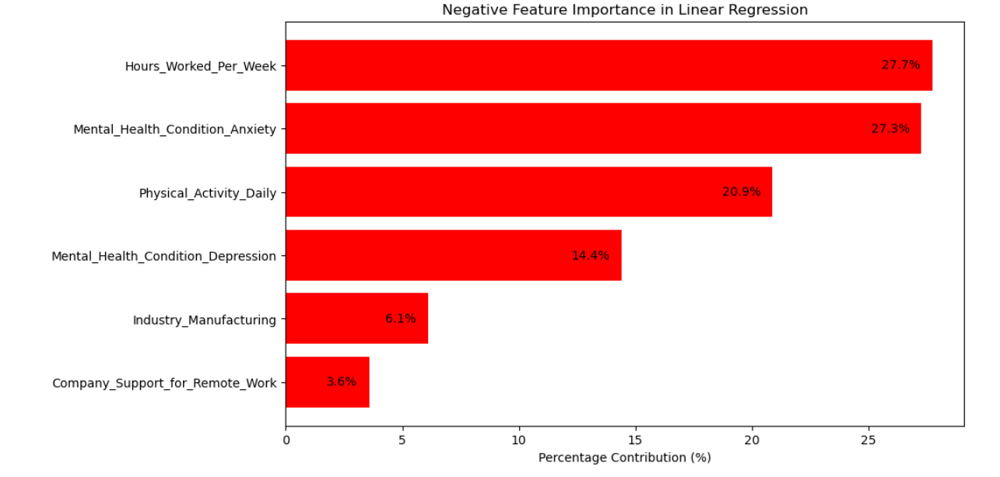

# Final Project: Impact of Work Environment on Mental Health

This project analyzes the impact of work environment on mental health using data from Kaggle and various data science tools like Jupyter Notebook, PostgreSQL, and Power BI for visualizations. Follow the steps below to set up and replicate the project.

---

## Project Overview
1. Download and set up the required tools and datasets.
2. Perform data analysis using Jupyter notebooks.
3. Set up a PostgreSQL database and import data.
4. Create insightful dashboards using Power BI.

---

## Tools and Installation Guide

### 1. Install All Required Tools
#### Jupyter Notebook
- **Using pip**: 
  ```bash
  pip install notebook
  ```
- **Using Anaconda**: 
  ```bash
  conda install -c conda-forge notebook
  ```

#### PostgreSQL
- **Download and Install**: Visit the [official PostgreSQL website](https://www.postgresql.org/download/) to download and install PostgreSQL on your system.

#### Power BI
- **Download Power BI Desktop**: Install Power BI Desktop from the [official Power BI website](https://powerbi.microsoft.com/desktop/).

### 2. Download the Datasets
- **Dataset 1**: [Remote Work and Mental Health](https://www.kaggle.com/datasets/waqi786/remote-work-and-mental-health/data)
- **Dataset 2**: [Work-Life Balance Analysis](https://www.kaggle.com/code/sasakitetsuya/work-life-balance-analysis-by-automl-pycaret/input)

---

## Analysis Activities

### 1. Run Jupyter Notebooks
1. **Data Processing**:
   - Data Cleaning, Scaling/Normalization,Encoding Categorical Variables.
2. **Correlation Matrix**:
   - Open `Correlation.ipynb` in Jupyter Notebook and run all cells to generate
   
    .

3. **Linear Regression**:
   - Open `LinearRegression.ipynb` in Jupyter Notebook and run all cells to generate 
   
   ### Negative Feature Importance in Linear Regression

   .

   ### Positive Feature Importance in Linear Regression

   .

   ### Feature Importance in Linear Regression

   .

   

### 2. Set Up PostgreSQL
1. **Create Database**:
   - Open the PostgreSQL query tool and run:
     ```sql
     CREATE DATABASE Final_Project;
     ```
2. **Create Tables**:
   - Open `tables_sql.txt` and run the SQL commands in the PostgreSQL query tool to create tables.

### 3. Import Data into PostgreSQL
- **Run Python Script**:
  - Open your terminal and execute:
    ```bash
    python import_data_postgre.py
    ```

### 4. Connect Power BI to PostgreSQL
1. **Open Power BI Desktop**.
2. **Connect to PostgreSQL**:
   - Use the database `Final_Project` to fetch the data.

## Visualizations

### Work Environment Analysis


### Work Life Balance Analysis


### Map


## Installation for Fonts on All OS
To ensure correct font display in your notebooks and Power BI dashboards, install fonts as follows:

### Windows
1. Download font files.
2. Right-click on each file and select "Install."

### macOS
1. Download font files.
2. Double-click each file and click "Install Font."

### Linux
1. Download font files.
2. Copy them to `/usr/share/fonts`:
   ```bash
   sudo cp /path/to/font.ttf /usr/share/fonts
   ```
3. Refresh the font cache:
   ```bash
   sudo fc-cache -fv
   ```

---

## Additional Notes
- Ensure Python and pip are installed on your system.
- Use `pgAdmin` for a graphical interface with PostgreSQL.
- Place all files, including Python scripts, notebooks, and images, in the project directory for easier access.
