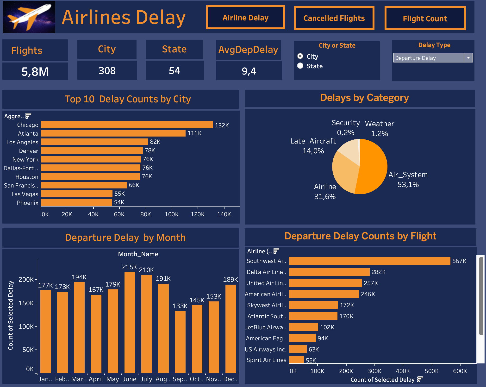
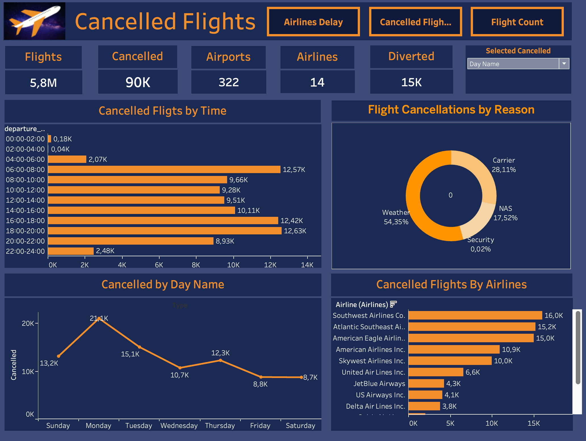
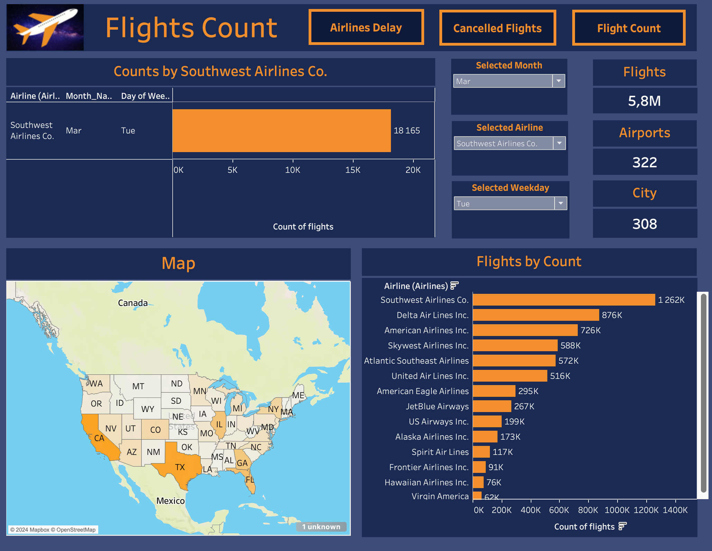

# Flight Dashboard Project

## Overview

This project is a Tableau dashboard that provides insights into flight data. The dashboard is designed to help users visualize and analyze various aspects of flights, such as flight numbers, airlines, tail numbers, and origin airports.

## Features

- **Interactive Visualizations**: Users can interact with the visualizations to filter and drill down into specific data points.
- **Flight Data Analysis**: The dashboard provides a comprehensive analysis of flight information.
- **User-Friendly Interface**: Designed with ease of use in mind, the dashboard is intuitive and accessible.

## Project Structure

- `data/`: Contains the flight data files used in the dashboard.
- `dashboards/`: Tableau workbook files (`.twb` or `.twbx`) with the flight dashboard.
- `images/`: Screenshots of the dashboard for preview.
- `README.md`: Project documentation.

## Data Source

The flight data used in this project includes the following fields:

- **Airline**: The airline operating the flight.
- **Tail Number**: The unique identifier for the aircraft.
- **Origin Airport**: The airport where the flight originates.
- **Flight Number**: The flight number assigned by the airline.

You can download the flight data from [Kaggle](https://www.kaggle.com/datasets/usdot/flight-delays/data?select=flights.csv).

## Setup and Usage

1. **Clone the Repository**:
   ```sh
   git clone https://github.com/vahkhachatryan/flight-dashboard.git
   cd flight-dashboard
   ```

2. **Download the Data**:
   - Download the flight data from [Kaggle](https://www.kaggle.com/datasets/usdot/flight-delays/data?select=flights.csv).
   - Place the downloaded `flights.csv` file in the `data/` directory.

3. **Open the Tableau Workbook**:
   - Open Tableau Desktop.
   - Open the `.twb` or `.twbx` file located in the `dashboards/` directory.

4. **Connect to Data**:
   - Ensure the data files are available in the `data/` directory.
   - If necessary, update the data source paths in Tableau.

## Visualizations

### Flights Count



### Cancelled Flights



### Airlines Delay



## Contribution

Contributions are welcome! If you would like to contribute to this project, please follow these steps:

1. Fork the repository.
2. Create a new branch: `git checkout -b feature-branch-name`
3. Make your changes and commit them: `git commit -m 'Add some feature'`
4. Push to the branch: `git push origin feature-branch-name`
5. Submit a pull request.

